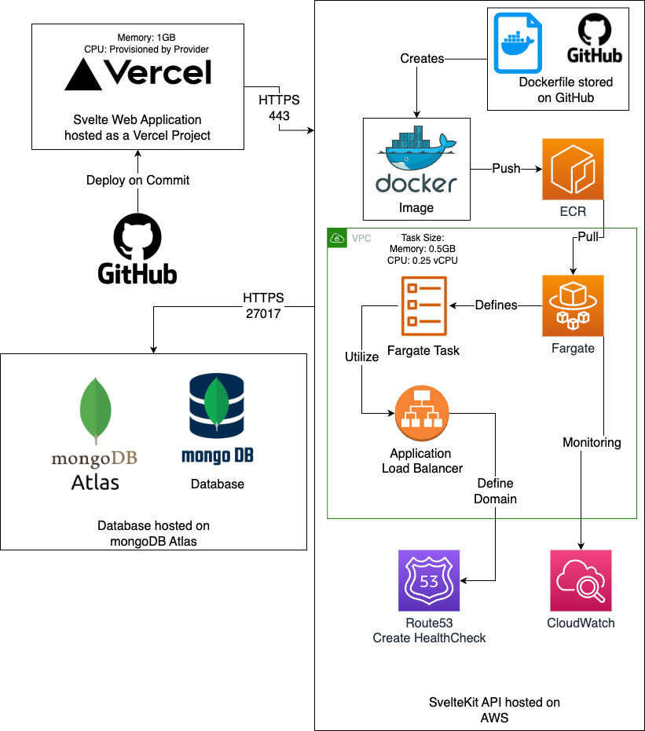
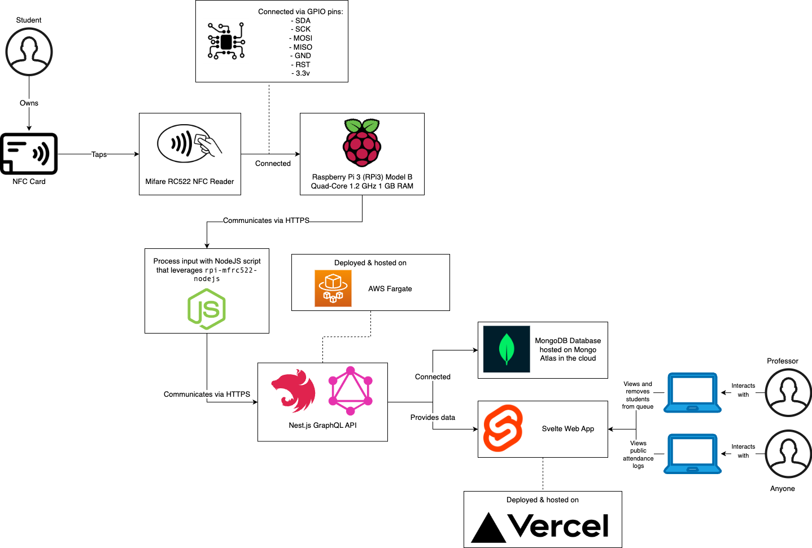
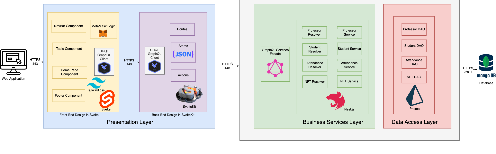
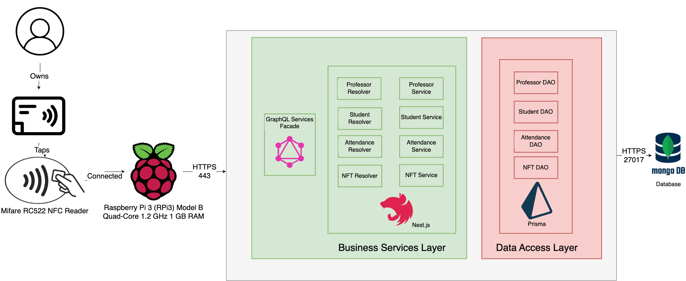

# CrimLog

Table of Contents
- [CrimLog](#crimlog)
  - [Introduction](#introduction)
  - [Problem and Solution](#problem-and-solution)
  - [Requirements](#requirements)
    - [High-Level Requirements](#high-level-requirements)
    - [Non-Functional Requirements](#non-functional-requirements)
  - [Technologies](#technologies)
    - [Near-Field Communication (NFC)](#near-field-communication-nfc)
    - [Raspberry Pi 3 (RPi3) Model B Quad-Core 1.2 GHz 1 GB RAM](#raspberry-pi-3-rpi3-model-b-quad-core-12-ghz-1-gb-ram)
    - [Mifare RC522 NFC Reader](#mifare-rc522-nfc-reader)
    - [NFC Card](#nfc-card)
    - [NodeJS 16.18 LTS](#nodejs-1618-lts)
    - [Svelte 3.51](#svelte-351)
    - [Tailwind CSS 3.1](#tailwind-css-31)
    - [DaisyUI 2.31](#daisyui-231)
    - [SvelteKit 1.0](#sveltekit-10)
    - [TypeScript 4.9](#typescript-49)
    - [URKL GraphQL Client 3](#urkl-graphql-client-3)
    - [GraphQL 16.6](#graphql-166)
    - [Nest.JS 9.1](#nestjs-91)
    - [Prisma 4.6](#prisma-46)
    - [MongoDB 6.0](#mongodb-60)
    - [MongoDB Atlas](#mongodb-atlas)
    - [Vercel](#vercel)
    - [GitHub](#github)
    - [Docker](#docker)
    - [AWS Elastic Container Registry (ECR)](#aws-elastic-container-registry-ecr)
    - [AWS Elastic Container Service (ECS)](#aws-elastic-container-service-ecs)
    - [AWS Fargate](#aws-fargate)
    - [AWS Route53](#aws-route53)
    - [AWS CloudWatch](#aws-cloudwatch)
    - [Terraform](#terraform)
    - [GitHub Actions](#github-actions)
  - [Industry Best Practices](#industry-best-practices)
  - [Cloud Deployment](#cloud-deployment)
  - [New Technologies](#new-technologies)
  - [Technical Approach](#technical-approach)
    - [Block Diagram](#block-diagram)
    - [Logical Solution Design](#logical-solution-design)
    - [Physical Solution Design](#physical-solution-design)
    - [Detailed Technical Design Decision](#detailed-technical-design-decision)
      - [General Technical Approach](#general-technical-approach)
      - [Design \& Approach](#design--approach)
      - [Key Technical Design Decision](#key-technical-design-decision)
  - [Assessing Risks and Challenges](#assessing-risks-and-challenges)
  - [Project Status](#project-status)

## Introduction

CrimLog is an open-source software protocol that utilizes Web 3.0, near-field communication (NFC), and non-fungible tokens (NFTs) to create a student attendance solution that is unparalleled in the market. Unlike other products currently available, CrimLog provides students custom minted NFTs for each class. Due to NFTs immutable nature, once a student is marked as present there is no way for that to get revoked, which makes CrimLog the most reliable student attendance solution.  

A student will enter the classroom and tap their NFC card against an NFC reader, which will provide them with their NFT and mark their attendance. Behind the scenes, the NFC reader utilizes the NFC card’s unique identifier to associate the card with a particular student via their student ID number. This student ID number is added to the queue for the class, which is visible by the professor. Additionally, throughout the duration of the class, a professor may manually issue a NFT attendance mint for a student; however, if a manual action is not performed, NFTs will be minted automatically for the queue at the end of the class. To ensure students attend for the duration of the class, a professor may remove a student from the queue prior to the automatic trigger. Once the trigger is activated, the student’s digital wallet will be pulled and a custom NFT asset with classroom details will be minted into the student’s wallet. Finally, all attendance transactions will be viewable on a web dashboard and will include links to blockchain transactions. CrimLog is the ultimate student attendance software solution with superior functionality and support that is not present elsewhere on the market. 

## Problem and Solution
| The Problem                                                                                                                                                                                                                                                                                                                                               | The Solution                                                                                                                                                                                                  |
| --------------------------------------------------------------------------------------------------------------------------------------------------------------------------------------------------------------------------------------------------------------------------------------------------------------------------------------------------------- | ------------------------------------------------------------------------------------------------------------------------------------------------------------------------------------------------------------- |
| Most universities require participation from their students by recording student attendance for every class. However, there is not an attendance software solution on the market that records participation accurately, quickly, and reliably. Most current implementations are performed manually and are slow, antiquated, hard to use, and unreliable. | CrimLog is an open-source software protocol that utilizes Web 3.0, near-field communication (NFC), and non-fungible tokens (NFTs) to create a student attendance solution that is unparalleled in the market. |

## Requirements

CrimLog features both high-level and non-functional requirements that are supported.

### High-Level Requirements
- Utilize Raspberry Pi to read and process NFC card data
- Send NFC card data from the Raspberry Pi to a backend API
- Process NFC card data in the API
- Add students to a queue on a web application after receiving a NFC card tap
- Allow professor to login to the website using MetaMask
- Create queue for each class when it begins
- Mint NFTs for all students in the queue once class ends
- Allow professors to remove students from the queue
- Allow professors to manually mint all students in the queue an NFT
- Store all NFTs and student information in a cloud database
- Allow anyone to view all participation NFTs on the blockchain

### Non-Functional Requirements
- Public documentation for CrimLog including a comprehensive README
- Public documentation for the CrimLog API
- Documentation for all API endpoints
- CrimLog Open Source Code base
- CrimLog public project board
- Allow anyone to add issues to the CrimLog project
- Utilize a uniform linting and formatting style

## Technologies
### Near-Field Communication (NFC) 

Purpose – Allow students to conveniently mark their participation within a class and eliminate the professor having to track participation manually. 

Chosen – Chosen for its convenience. Additionally, its growing popularity and the accessibility it provides for the project. 
 
### Raspberry Pi 3 (RPi3) Model B Quad-Core 1.2 GHz 1 GB RAM 

Purpose – Allows hardware and software components to be connected. 

Chosen – Chosen for its ability to easily connect hardware and software components.  

### Mifare RC522 NFC Reader 

Purpose – Allows the Raspberry Pi to receive NFC card inputs. 

Chosen – Chosen to provide compatibility between NFC cards and the Raspberry Pi and necessary because NFC was chosen as the technology for students to input their participation.  

### NFC Card 

Purpose – Allows the student to conveniently mark their participation within the class. Provides input for the NFC Card Reader. 

Chosen – Chosen to provide students with an easy way to mark their participation. Allows NFC to be utilized and provides the input for the NFC Card Reader, which allows the Raspberry Pi to operate. 

### NodeJS 16.18 LTS  

Purpose – Process the NFC input of the Raspberry Pi. Once the input has been processed, this script alerts the API that as can has been made to begin the process of inputting the student into the queue.  

Chosen – Chosen to provide a way for the Raspberry Pi hardware to communicate with the API software. NodeJS was chosen because team members of CrimLog have experience with the software and its compatibility with the Raspberry Pi Hardware. 
 
### Svelte 3.51 

Purpose – Create the front end of the web application for CrimLog. 

Chosen – Chosen because the framework reduces the amount of boilerplate code written by developers.  

### Tailwind CSS 3.1 

Purpose – Provide styling to the front-end web application components for CrimLog 

Chosen – Chosen because the framework helps developers write and maintain CSS code within the application.  

### DaisyUI 2.31 

Purpose – DaisyUI is a Tailwind CSS component library that provides further styling options for CrimLog 

Chosen – Chosen because the component library helps developers utilize Tailwind CSS for faster development, cleaner HTML, and more customization. 

### SvelteKit 1.0 

Purpose – Create the back end of the web application for CrimLog. 

Chosen – Chosen because it is the fastest way to build web applications in Svelte. 

### TypeScript 4.9 

Purpose – TypeScript will be utilized to create the CrimLog API 

Chosen – Chosen because it excels at longevity and eliminates technical debt in environments where numerous developers contribute to the codebase, like in open-source software projects.  

### URKL GraphQL Client 3 

Purpose – Manages local and remote data with GraphQL. 

Chosen – Chosen to help structure code in a predictable and declarative manner that is consistent with modern development practices. Additionally, allows the front end and back end to manage data with GraphQL.  

### GraphQL 16.6 
Purpose – Query the CrimLog API. 

Chosen – Chosen as the query language because it provides CrimLog the exact data requested. GraphQL was chosen for its speed and predictable results, providing the developer more control of data.  

### Nest.JS 9.1 

Purpose – Create services found in the business layer. 

Chosen – Chosen because it is lightweight and promotes code reusability, reducing the amount of programming for CrimLog developers. 

### Prisma 4.6 
Purpose – Create data access objects found in the data layer. Retrieve data from the MongoDB database. 

Chosen – Chosen because it provides intuitive data models, type safety, and autocompletion, reducing the amount of programming for CrimLog developers. 
 
### MongoDB 6.0  

Purpose – Store data to track students within a queue 

Chosen – Chosen because it is a non-relational database. Additionally, it is simple to use while being efficient and effective. 

### MongoDB Atlas 
Purpose – Host the MongoDB Database in the cloud. 

Chosen – Chosen because it is easy to implement with MongoDB database. Additionally, it has a simple installation and does not have a high cost.  

### Vercel 

Purpose – Host the Svelte Web application. 

Chosen – Vercel was chosen because it is a simple and effective way to host a web application in the cloud with continuous integration and deployment while developing. 

### GitHub 
Purpose – Allows developers on the team to make changes to the code at the same time. Allows code to be stored in the cloud to prevent data from being lost.  

Chosen – GitHub is an industry standard for Git. Additionally, developers at CrimLog have experience with GitHub and it integrates with Vercel. 

### Docker 

Purpose – Containerizes the application into an image, which allows CrimLog to leverage Amazon Web Services (AWS) for cloud hosting. 

Chosen – Docker was chosen because it integrates with the AWS cloud provider and is an industry standard. Additionally, developers at CrimLog have experience with Docker. 

### AWS Elastic Container Registry (ECR) 

Purpose – Stores the Docker image for the CrimLog API and integrates easily with other AWS projects selected for the completion of the project. 

Chosen – Industry standard for storing Docker Images to be utilized with other AWS services. 

### AWS Elastic Container Service (ECS) 

Purpose – Allows CrimLog to host the CrimLog API within AWS and easily integrate with ECR, which provides ease of access for pulling the Docker Image.  

Chosen – Industry standard for hosting applications in AWS. Provides more customization than AWS Elastic Beanstalk. 

### AWS Fargate 
Purpose – Allows CrimLog to host the CrimLog API on the AWS cloud without having to manage servers. 

Chosen – Industry standard for hosting applications and integrates well with ECS and ECR.  

### AWS Route53 

Purpose – Creates a domain for CrimLog to utilize on the cloud, allowing users to access the site on the Internet through a domain rather than connecting directly to an application load balancer. 

Chosen – Industry standard for creating a domain within AWS. Additionally, this will allow CrimLog to easily implement a HealthCheck for the application. 

### AWS CloudWatch 
Purpose – Monitor the CrimLog application hosting in AWS. 

Chosen – Industry standard for monitoring application within AWS. Additionally, it is automatically integrated upon the creation of a Fargate service. 

### Terraform
Purpose - Deploy CrimLog application components to the cloud.

Chosen - Industry standard for making cloud deployments to a variety of platforms, including AWS. Provides consistent, reusable, and uniform cloud infrastructure and prevents users from having to make cloud deployments manually within the AWS console.

### GitHub Actions
Purpose - Run CrimLog terraform for cloud deployments.

Chosen - Industry standard that makes it easy to run terraform code and implement a CI/CD pipeline.

## Industry Best Practices
- Setup uniformed linting and formatting styles
- Create and follow rules for utilizing Git including branch naming conventions
- Utilizing reliable cloud platforms including AWS and Vercel
- Operating and making cloud deployments utilizing Terraform, an infrastructure as code platform
- Perform peer reviews of code before merging into development 
- Perform QA on code before pushing pto production
- Create and run unit tests
- Utilizing test driven development
- Plan development work using a project board and GitHub issues

## Cloud Deployment
The CrimLog cloud deployment strategy is shown in the diagram below. The AWS Cloud Deployment is deployed utilizing Terraform, which is run with GitHub Actions as part of CrimLog's CI/CD pipeline.

For a larger view of of the diagram, click [here](https://bit.ly/crimlog_hardwarediagram )

The Svelte Web Application will be hosted as a Vercel Project. Vercel connects to a GitHub repository and automatically publishes and deploys changes when code is committed to the repository. The Vercel project will be configured with 1GB memory while the CPU is provisioned by the provider.  

 

The MongoDB Database will be hosted within mongoDB Atlas. The mongoDB database within mongoDB Atlas will be configured manually in the mongoDB Atlas console. 

 

The API built within SvelteKit will be hosted within AWS and configured through the AWS Management Console. Within GitHub, CrimLog will store a Dockerfile, which creates a Docker Image. This docker image will be pushed and stored within AWS elastic container registry (ECR). CrimLog will also be leveraging the AWS elastic container service (ECS). A cluster is created and configured to utilize Fargate to run the Docker image alongside a virtual private cloud (VPC). Additionally, a task definition will be created, which defines what Docker image should be run and how it should run, which once again will be configured to be utilized with Fargate. This task will utilize the smallest amount of memory and CPU to reduce costs, with a configuration of 0.5GB memory and 0.25vCPU CPU. Moreover, a service, security group, and load balancer will be configured for the cluster, once again for Fargate, where CrimLog will utilize the already created VPC. Once completed, CrimLog will have a public task running in Fargate, which makes it accessible to other users since it is in the cloud. However, rather than having people access the task-instances directly, CrimLog will utilize Route53 to create a domain name to direct to the load balancer to expose the site on the Internet. Now, CrimLog will be hosted on AWS utilizing Fargate and be accessible with a specific domain name configured in Route53. 

## New Technologies
CrimLog learned a variety of Web 3.0 technologies and AWS cloud hosting information including:
- Minting NFTs off the blockchain using Polygon
- Establishing and utilizing smart contracts
- Integrating with MetaMask for authentication
- AWS Fargate
- AWS ECS/EC2
- AWS Load Balancing
- AWS Secret Manager
- AWS Cloudwatch
- Terraform

CrimLog chose to learn Web 3.0 because we wanted to ensure we were on the cutting edge of technology. Additionally, we learned how to mint NFTs using Polygon because we wanted to have immutable proof of attendance, which is a feature NFTs provide. Additionally, we integrated with MetaMask for authentication to continue the Web 3.0 concept of decentralization. Different aspects of AWS were learned because AWS is an industry standard technology that is reliable for hosting. Additionally, AWS is a powerful tool for CrimLog because it allows our API to be hosted reliably and allow us to gain insight into our application through logs. Moreover, CrimLog learned Terraform, an infrastructure as code language, to deploy to the cloud using a code-based configuration rather than configuring deployments manually through the AWS console. 

## Technical Approach
These diagrams will provide a high-level design of the design and execution of CrimLog. Additionally, these diagrams and flow processes will show how the application will operate from the user’s perspective. 

### Block Diagram
This diagram provides a high-level view of the overall technological design for CrimLog. 

For a larger view of the diagram, please click [here](https://bit.ly/crimlog_blockdiagram_tech)  

 

This diagram shows a high-level view of the process flow including technological design for  CrimLog. A user with an NFC card will tap the card against an NFC Reader. This NFC reader is connected through GPIO pins to the Raspberry Pi. The Raspberry Pi will communicate with a NodeJS Script, that will process the input of the NFC card. The script will then take the processed input and communicate the output with the Nest.js GraphQL API. This API will be hosted in AWS Fargate. Additionally, the API is connected and retrieves data from a MongoDB Database, which will be hosted on Mongo Atlas. Additionally, the API provides data to the Svelte Web Application hosted on Vercel. Professors will be able to interact with the web application to view and remove students from the queue, which will send data to the API to update the database. Additionally, all users can interact with the web application and view the public attendance logs, which will retrieve information from the MongoDB database via the API.  

### Logical Solution Design
This diagram provides a high-level view of the web application for CrimLog utilizing Nest.js, GraphQL API, Svelte, and MongoDB.  

For a larger view of the diagram, please click [here](https://bit.ly/crimlog_logicaldiagram)

This diagram outlines the software solution and design for the web application portion of CrimLog. Utilizing the N-Layer design, the Presentation layer will utilize Svelte components with Tailwind CSS and Svelte kit routing and stores in tandem with the URKL GraphQL Client to communicate with the web application and business service layer. The business service layer will utilize GraphQL services façade and Nest.js services, with a component service for each data access component. The data access layer will utilize Prisma for each DAO component, which will be communication and querying the MongoDB database directly. These connections will all be established through HTTPs. 

This diagram provides a high-level view of the Raspberry Pi configuration for CrimLog.

For a larger view of the diagram, please click [here](https://bit.ly/crimlog_pi_logicaldiagram)

This diagram outlines the software solution and design for the Raspberry Pi NFC portion of CrimLog. A user taps an NFC card against the NFC reader, which is connected to a Raspberry Pi. This Raspberry Pi will communicate over HTTPs to the Business Layer. A NodeJS Script leveraging rpi-mfrc522-nodejs will process the tap and communicate with the GraphQL API endpoints. From this point, data will be pulled in the same way described above between the business services and data access layers, allowing for code reusability. 

### Physical Solution Design
This diagram provides a high-level view of the cloud infrastructure.

For a larger view of the diagram, please click [here](https://bit.ly/crimlog_hardwarediagram )

The Svelte Web Application will be hosted as a Vercel Project. Vercel connects to a GitHub repository and automatically publishes and deploys changes when code is committed to the repository. The Vercel project will be configured with 1GB memory while the CPU is provisioned by the provider.  

 

The MongoDB Database will be hosted within mongoDB Atlas. The mongoDB database within mongoDB Atlas will be configured manually in the mongoDB Atlas console. 

 

The API built within SvelteKit will be hosted within AWS and configured through the AWS Management Console. Within GitHub, CrimLog will store a Dockerfile, which creates a Docker Image. This docker image will be pushed and stored within AWS elastic container registry (ECR). CrimLog will also be leveraging the AWS elastic container service (ECS). A cluster is created and configured to utilize Fargate to run the Docker image alongside a virtual private cloud (VPC). Additionally, a task definition will be created, which defines what Docker image should be run and how it should run, which once again will be configured to be utilized with Fargate. This task will utilize the smallest amount of memory and CPU to reduce costs, with a configuration of 0.5GB memory and 0.25vCPU CPU. Moreover, a service, security group, and load balancer will be configured for the cluster, once again for Fargate, where CrimLog will utilize the already created VPC. Once completed, CrimLog will have a public task running in Fargate, which makes it accessible to other users since it is in the cloud. However, rather than having people access the task-instances directly, CrimLog will utilize Route53 to create a domain name to direct to the load balancer to expose the site on the Internet. Now, CrimLog will be hosted on AWS utilizing Fargate and be accessible with a specific domain name configured in Route53. 

### Detailed Technical Design Decision
#### General Technical Approach
Details of the design and approach will be outlined in the Detailed Technical Design section of this design report, providing a detailed view of key technical design decisions such as chosen technologies and frameworks, details of the team’s proof of concept, a database design, a diagram showing the process flow of the application, a sitemap, user interface designs, component diagrams, service API documentation, information about the non-functional requirement which is external API documentation, operational support design, and other supporting documentation. 

#### Design & Approach
CrimLog approaches design with one mission in mind, Keep it Clean n KISS (keep it simple stupid) it (KICK it). The KICKit mentality focuses on keeping code and infrastructure practices simple. Rather than getting tangled in unnecessary complexity, CrimLog will utilize best practices and technologies within the industry to deliver code that is clean, accomplishing the necessary tasks while cutting the fluff. A KICKit focus helps CrimLog stay on the cutting edge of technology. Using KICKit, code is adaptable, flexible, and dynamic, so as the industry changes, CrimLog changes alongside it. CrimLog is not simply another participation software solution, CrimLog is THE participation software solution. 

 

CrimLog approaches logical and hardware solution diagram design with the KICKit mindset. The logical solution design comprehensively displays the design and configuration of the software utilized to create the web application. Additionally, a diagram is created to show the interaction and relationship between the Raspberry Pi hardware and software components. Furthermore, the hardware solution displays the cloud hosting providers and configurations utilized by CrimLog to make the program accessible on the Internet. The KICKit mentality is used throughout the planning process because the configuration and design emphasize ease of use, simplicity, and clean practices. Rather than create over-complex solutions, CrimLog strives to design solutions that are powerful and efficient.  

#### Key Technical Design Decision
CrimLog is leveraging near-field communication (NFC) technology, which is a cross-platform software that is also used by some of the biggest companies in the industry including Apple, Google, and Bank of America. Additionally, CrimLog is further setting itself apart by using Web3 technologies and concepts through non-fungible tokens (NFTs). To record participation, a user will tap an NFC card against an NFC reader, which will process this tap and add the user to a queue, viewable on a web application. Once in the queue, a professor can remove a user or mint an NFT for them. Once the class ends or when issued by a professor, an NFT will be minted for each student, which will act as their record for participation. Since CrimLog is leveraging NFTs, the student's participation is immutable, eliminating human error and unauthorized tampering.  

 

CrimLog utilizes both hardware and software to create its participation software solution. The hardware components explained above will be connected to software components. A script created in JavaScript will run in a NodeJS environment on the Raspberry Pi whenever an NFC tap is inputted. This script will process the input and transport it between business and data access layers to update the database. Once this database has been updated, the presentation layer will detect the changes by polling the API and update the display of the web application to match the database. The business layer utilizes a GraphQL service façade, with services created in Nest.js. The Data Access layer will have data access objects created with the Prisma Client. This layer communicates with the service layer and the MongoDB database, querying the database to retrieve and modify data. The presentation layer will include a front end and back end created in Svelte with Tailwind CSS and SvelteKit respectively. The back end communicates with the business service layer and defines the stores, actions, and routes for the web application. Both the back end and front end will utilize the URKL GraphQL client to handle data. The back end and front end communicate with each other in the presentation layer to display and modify data. The front end houses the DaisyUI components that make up the website and create the user interface that the user can view and interact with. Some components within this front end include a home, navigation bar, met mask login, and table view. This allows the web application to accurately display information within the database. 

## Assessing Risks and Challenges
Risks and Challenges:
- Minting NFTs 
- Setting up AWS Infrastructure
- Setting up Vercel
- MetaMask Authentication
- Configuring Terraform

To mint NFTs, CrimLog utilized OpenSea and Polygon alongside the Matic Mumbai network. This was a risk because we had no prior experience with connecting and integrating with blockchain technologies. To overcome these risks, we reviewed the documentation for a variety of technologies and watched YouTube videos related to these technologies. 

To setup AWS infrastructure, CrimLog utilized a Terraform configuration alongside GitHub Actions to make deployments. Additionally, research about various AWS technologies was performed so a practical infrastructure plan would be created. To conduct this research, AWS and Terraform documentation was used alongside previous knowledge.

To setup Vercel, CrimLog researched a variety of cloud deployment platforms. Vercel was chosen for its reliability and ease of use. Its powerful CI/CD integration that easily allows for updates on commmits contributed to the reason it was chosen. To implement Vercel, the documentation for the technology was used.

To setup MetaMask, CrimLog researched authentication methods for decentralized apps. To implement MetaMask, documentation and YouTube were utilized.

## Project Status
All current features, issues, and project status information can be found on the CrimLog project board, which can be accessed by clicking [here](https://github.com/orgs/crimlog/projects/1/views/2)

